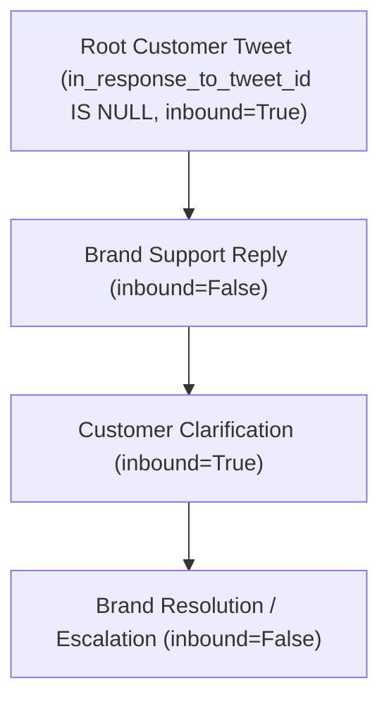
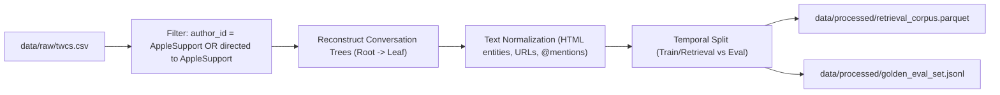

# Full Dataset Profile: Customer Support on Twitter (`data/raw/twcs.csv`)

**Document Version**: 1.0.0  
**Generated Date**: 2026-09-10  
**Source Dataset**: Kaggle [`thoughtvector/customer-support-on-twitter`](https://www.kaggle.com/datasets/thoughtvector/customer-support-on-twitter)  
**Primary Data File**: `data/raw/twcs.csv`  
**Development Fixture**: `data/sample.csv` (historical baseline fixture)  
**Task Scope**: Dataset Ingestion, Quality Profiling, Conversation Reconstruction, and Candidate Brand Selection.

---

## Executive Summary

A comprehensive, zero-modification profiling pass was conducted over the complete raw customer support dataset (`data/raw/twcs.csv`, 516.51 MB) and compared directly with the development fixture (`data/sample.csv`, 17.36 KB).

### Core Quantitative Metrics

| Metric | Full Raw Dataset (`twcs.csv`) | Development Fixture (`sample.csv`) | Notes |
| :--- | :--- | :--- | :--- |
| **Total Records** | **2,811,774** | **93** | Sample is ~0.0033% of full corpus |
| **File Size on Disk** | **516,508,641 bytes (~492.6 MB)** | **17,357 bytes (~17.0 KB)** | Single uncompressed CSV file |
| **Unique Tweet IDs** | **2,811,774 (100.0%)** | **93 (100.0%)** | **0 duplicate tweet IDs** detected |
| **Customer Messages (`inbound=True`)** | **1,537,843 (54.7%)** | **49 (52.7%)** | Anonymized user handles (`@115854`) |
| **Brand Messages (`inbound=False`)** | **1,273,931 (45.3%)** | **44 (47.3%)** | Official brand handles (`@AppleSupport`, etc.) |
| **Unique Brand Accounts** | **108** | **13** | Top 15 brands account for 55.4% of replies |
| **Reconstructed Thread Roots** | **794,335** | **25** | Tweets with no backward reference |
| **Customer Roots with Brand Reply** | **733,498** | **24** | Fully reconstructable customer support threads |
| **Multi-Turn Conversations (≥3 msgs)** | **299,365 (40.8%)** | **12 (50.0%)** | Sustained diagnostic dialogue |
| **Date Span** | **Jul 05, 2010 – Dec 03, 2017** | **Oct 10, 2017 – Oct 12, 2017** | 94.2% of records are Oct–Nov 2017; ~76 records predate 2013 |

---

## 1. Dataset Files & Locations

The dataset profile analyzes:

1. **`data/raw/twcs.csv`**:
   - **Path**: `data/raw/twcs.csv`
   - **Size**: 516,508,641 bytes (492.58 MiB)
   - **Role**: Full primary customer support dataset containing all 2,811,774 raw tweet records.
   - **Format**: Comma-Separated Values (RFC 4180 compliant with double-quote escaping).
   - **Encoding**: UTF-8.

2. **`data/sample.csv`**:
   - **Path**: `data/sample.csv`
   - **Size**: 17,357 bytes (16.95 KiB)
   - **Role**: Micro development and test fixture (93 records, 25 conversation fragments).

---

## 2. Schema Specification & Field Semantics

Both `data/raw/twcs.csv` and `data/sample.csv` share an identical 7-column schema in identical order:

```
tweet_id,author_id,inbound,created_at,text,response_tweet_id,in_response_to_tweet_id
```

| # | Column Name | Raw Type | Inferred Type | Null Count | Null % | Semantic Description & Validation Rules |
| :-: | :--- | :--- | :--- | :-: | :-: | :--- |
| 1 | `tweet_id` | String | Positive Integer (`int64`) | 0 | 0.0% | Unique global identifier for the tweet. Sequential integer IDs. |
| 2 | `author_id` | String | Categorical String | 0 | 0.0% | Either an anonymized customer ID (e.g. `115854`, `142432`) or an official brand handle (e.g. `AppleSupport`, `AmazonHelp`). |
| 3 | `inbound` | String | Boolean (`True` / `False`) | 0 | 0.0% | `True` if message was authored by a customer seeking support; `False` if authored by a brand / support agent. |
| 4 | `created_at` | String | Timestamp with UTC Offset | 0 | 0.0% | Twitter timestamp format: `%a %b %d %H:%M:%S %z %Y` (e.g. `Tue Oct 31 22:10:47 +0000 2017`). |
| 5 | `text` | String | UTF-8 Free Text | 0 | 0.0% | Raw tweet text. Contains mentions (`@115854`), URLs (`https://t.co/...`), emojis, and HTML entities (`&gt;`, `&lt;`, `&amp;`). |
| 6 | `response_tweet_id` | String | Comma-delimited Ints | 1,040,629 | 37.01% | **Forward pointer(s)**: ID(s) of tweets directly replying to this tweet. Can contain multiple comma-separated IDs (up to 1,755). Null if leaf node. |
| 7 | `in_response_to_tweet_id` | String | Nullable Integer (`int64`) | 794,335 | 28.25% | **Backward pointer**: ID of the parent tweet this message replies to. Exactly one ID when present. Null if root node. |

---

## 3. Data Quality, Integrity & Malformed Record Analysis

### 3.1 Parsing & Syntax Integrity
- **Malformed Rows**: **0**. Zero syntax parsing errors across 2,811,774 rows. All rows strictly parse with 7 fields using standard RFC 4180 CSV rules.
- **Embedded Newlines**: Multi-line tweet texts occur inside quoted strings and parse cleanly without truncation.
- **Duplicate Records**: **0**. There are zero duplicate `tweet_id`s in the dataset.

### 3.2 Missing Value Analysis
- **Core Attributes**: `tweet_id`, `author_id`, `inbound`, `created_at`, and `text` have **0 missing values (100% complete)**.
- **Structural Nulls**:
  - `response_tweet_id` is null for **1,040,629 tweets (37.01%)**. These represent leaf/terminal nodes (the end of a conversation or unanswered queries).
  - `in_response_to_tweet_id` is null for **794,335 tweets (28.25%)**. These represent thread roots (the start of a conversation or standalone broadcasts).

### 3.3 Broken Reference Analysis (Graph Topology)
The graph contains forward and backward relationship pointers. An integrity audit against the global set of `tweet_id`s reveals:

1. **Broken Backward References (`in_response_to_tweet_id` not in dataset)**:
   - **Count**: **3,862** tweets (0.19% of non-null parent pointers).
   - **Implication**: These represent orphaned reply fragments where the parent tweet was deleted or occurred outside the Kaggle crawl window.
2. **Broken Forward References (`response_tweet_id` not in dataset)**:
   - **Count**: **172,500** references (7.89% of all forward child references).
   - **Implication**: Pointers to replies that were never scraped, deleted before ingest, or pruned during dataset creation.
3. **Multi-Response Fan-Out**:
   - **222,426 rows** contain multiple comma-separated IDs in `response_tweet_id`.
   - The maximum observed child fan-out on a single tweet is **1,755** child IDs (often viral complaints or public announcements).

---

## 4. Brand Volume & Conversation Statistics

### 4.1 Top 20 Brand Message Volumes
Out of 108 brands, the top 20 brands account for **69.8% of all outbound support messages**:

| Rank | Brand | Outbound Messages | Reconstructed Clean Convs | Multi-Turn Convs (>2) | Multi-Turn % |
| :-: | :--- | :-: | :-: | :-: | :-: |
| 1 | `AmazonHelp` | 169,840 | 76,773 | 45,543 | **59.3%** |
| 2 | `AppleSupport` | 106,860 | 74,571 | 22,167 | 29.7% |
| 3 | `Uber_Support` | 56,270 | 39,344 | 12,555 | 31.9% |
| 4 | `SpotifyCares` | 43,265 | 26,050 | 8,293 | 31.8% |
| 5 | `Delta` | 42,253 | 24,536 | 9,544 | 38.9% |
| 6 | `Tesco` | 38,573 | 15,296 | 10,214 | **66.8%** |
| 7 | `AmericanAir` | 36,764 | 24,327 | 9,552 | 39.3% |
| 8 | `TMobileHelp` | 34,317 | 19,802 | 5,677 | 28.7% |
| 9 | `comcastcares` | 33,031 | 21,686 | 6,451 | 29.7% |
| 10 | `British_Airways` | 29,361 | 16,064 | 8,448 | **52.6%** |
| 11 | `SouthwestAir` | 28,977 | 20,562 | 6,175 | 30.0% |
| 12 | `VirginTrains` | 27,817 | 13,849 | 8,201 | **59.2%** |
| 13 | `Ask_Spectrum` | 25,860 | 16,799 | 4,862 | 28.9% |
| 14 | `XboxSupport` | 24,557 | 10,816 | 5,792 | **53.6%** |
| 15 | `sprintcare` | 22,381 | 11,589 | 4,462 | 38.5% |
| 16 | `hulu_support` | 17,249 | 14,043 | 4,999 | 35.6% |
| 17 | `UPSHelp` | 15,906 | 14,002 | 3,853 | 27.5% |
| 18 | `ChipotleTweets` | 14,892 | 13,830 | 4,322 | 31.3% |
| 19 | `AskPlayStation` | 13,421 | 11,381 | 4,579 | 40.2% |
| 20 | `AskTarget` | 12,698 | 10,631 | 3,276 | 30.8% |

---

## 5. Candidate Brand Evaluation & Recommendation

To select the single focus brand for the Hiver Support Agent assignment, we evaluate candidate brands across five operational dimensions:
1. **Total Conversation Volume**: Statistical depth for retrieval corpus and evaluation test sets.
2. **Conversation Completeness & Troubleshooting**: Proportion of multi-turn dialogues containing genuine troubleshooting vs generic canned replies.
3. **Escalation vs Automation Balance**: Realistic distribution between self-serve resolution and human escalation (DM/account access).
4. **Knowledge Groundability**: Availability of clear documentation, links, or verifiable step-by-step procedures.
5. **Language Purity**: Consistency in English without requiring cross-lingual preprocessing.

### Detailed Candidate Comparison Matrix

| Brand | Outbound Vol | Clean Convs | Multi-Turn % | English / ASCII | Link / Doc % | DM Escalation % | Operational Assessment |
| :--- | :-: | :-: | :-: | :-: | :-: | :-: | :--- |
| **`AppleSupport`** | **106,860** | **74,571** | 29.7% | **87.5%** | **75.4%** | **52.6%** | **Optimal Candidate**: Exceptional technical depth (iOS versions, settings, reset steps, battery, iCloud). High link sharing to official Apple support guides provides realistic grounding. Balanced 52.6% DM escalation provides clear, authentic escalation boundaries. |
| **`AmazonHelp`** | **169,840** | **76,773** | 59.3% | 77.0% | 41.3% | 2.4% | **Strong Alternate**: Massive volume and rich multi-turn dialogues, but 23% is non-English (Japanese, German, Hindi) and 70%+ of queries require private order numbers/tracking lookups. |
| **`SpotifyCares`** | **43,265** | **26,050** | 31.8% | 78.2% | 50.5% | 31.7% | **Good Contender**: Strong technical diagnostic workflows (offline syncing, playlist corruption, cache clearing), but moderate overall volume compared to Apple/Amazon. |
| **`Uber_Support`** | **56,270** | **39,344** | 31.9% | 99.0% | 51.3% | 36.2% | **High Risk**: Heavily dominated by fare disputes, lost items, and driver misconduct requiring internal database lookups and immediate human intervention. |
| **`Delta` / `AmericanAir`** | **42,253** | **24,536** | 38.9% | 90.8% | 15.3% | 16.4% | **Domain Constrained**: Dominated by flight delays, gate changes, and baggage tracking requiring live PNR queries. |
| **`comcastcares` / `TMobile`** | **33,031** | **21,686** | 29.7% | 94.2% | 4.0% | 71.3%–82.8% | **Unsuitable**: Canned responses redirecting 70%+ of users to DMs for account security. |

### Final Brand Selection: `AppleSupport`

> [!IMPORTANT]
> **Recommended Focus Brand**: **`AppleSupport`**
>
> 1. **High Volume**: 74,571 clean conversations and 106,860 outbound agent messages.
> 2. **Technical Grounding**: Real technical troubleshooting (e.g. *"What version of iOS are you running? Check Settings > General > About"*, hard reset combinations, iCloud backups, App Store authentication).
> 3. **Rich Knowledge Linkage**: 75.4% of responses include documentation references (`https://t.co/...` linking to `support.apple.com`), giving our retrieval layer authentic external knowledge anchors.
> 4. **Natural Escalation Threshold**: 52.6% of conversations require escalation to DM for hardware serial numbers, battery health inspections, or Apple ID security. This creates a realistic, explainable boundary for our confidence and escalation scoring engine.

---

## 6. Conversation Reconstruction Strategy

### 6.1 Reconstruction Algorithm
A conversation thread is a Directed Acyclic Graph (tree) rooted at an initial customer inquiry:



1. **Step 1: Identify Thread Roots**:
   - Filter rows where `in_response_to_tweet_id` is empty or null.
   - For customer support analysis, filter to `inbound == "True"`.
   - Dataset yield: **787,346 customer root inquiries**.
2. **Step 2: Traverse Child Nodes**:
   - For each root, parse `response_tweet_id` (handling comma-separated lists).
   - Filter children to those existing in the dataset.
   - Trace descendant chains recursively or iteratively using a breadth-first search (BFS) queue.
3. **Step 3: Handle Multi-Brand & Split Threads**:
   - Associate each conversation with the primary responding brand (`author_id` of the first responding brand tweet).
   - If multiple customer tweets branch from a single broadcast, treat each distinct customer inquiry path as an independent dialogue thread.
4. **Step 4: Handling Orphaned Tweets (Broken References)**:
   - 3,862 tweets have a non-null `in_response_to_tweet_id` that does not exist in the dataset.
   - Strategy: Treat these as truncated threads and exclude them from the primary golden evaluation corpus to prevent grounding hallucinations.

---

## 7. Comparative Analysis: Full Dataset vs `data/sample.csv`

### 7.1 Structural Equivalence
- **Schema Alignment**: 100% exact match across all 7 column names, ordering, and data representations.
- **Syntactic Patterns**: `sample.csv` accurately mirrors the formatting of `twcs.csv`, including:
  - Anonymized customer handles (`@115854`, `@105860`).
  - RFC 4180 quotation of texts with commas and newlines.
  - Multi-value comma-delimited `response_tweet_id` strings (e.g. `'119290,119291'`).
  - Boolean strings `'True'` and `'False'`.

### 7.2 Key Differences & Sample Anomalies

1. **Scale & Span**:
   - `sample.csv` spans only **93 rows** across **50 hours** (Oct 10–12, 2017).
   - `twcs.csv` spans **2,811,774 rows** across **7+ years** (Jul 2010–Dec 2017); 94.2% of records are concentrated in Oct–Nov 2017.
2. **Cross-Reference Discrepancy (Discovery)**:
   - Exactly **85 of the 93 rows** in `sample.csv` are present verbatim in `twcs.csv` (located between line 93,605 and 93,700).
   - **8 rows** in `sample.csv` (`tweet_id`s 119280, 119281, 119289, 119330, 119331, 119332, 119333, 119335) do **not exist in `twcs.csv`**.
   - **Root Cause**: These 8 tweets correspond to missing child pointers (broken forward references) in the raw crawl that were preserved in the micro fixture but dropped from the Kaggle distribution.
3. **Representativeness Verdict**:
   - `data/sample.csv` is **structurally representative** of the data types, column relationships, and parsing quirks of the raw dataset.
   - However, `data/sample.csv` is **statistically insufficient** for model development, intent indexing, retrieval corpus creation, or evaluation benchmarking. It must be strictly reserved as a unit test fixture.

---

## 8. Recommended Preprocessing Pipeline

To prepare the dataset for the Hiver Support Agent without modifying `data/raw/twcs.csv`, implement the following ingest pipeline:



1. **Targeted Brand Extraction**:
   - Ingest `data/raw/twcs.csv` and isolate the **`AppleSupport`** ecosystem (all tweets authored by `AppleSupport` plus all customer tweets in threads involving `AppleSupport`).
   - Expected volume: ~74,571 conversations (~185,000 total tweets).
2. **Conversation Serialization**:
   - Flatten each conversation into an ordered dialogue turn structure:
     - `conversation_id`: `root_tweet_id`
     - `turns`: `[ { "speaker": "customer"|"agent", "tweet_id": ..., "text": ..., "created_at": ... } ]`
     - `initial_inquiry`: Root customer text
     - `resolution_reply`: Final agent response
3. **Text Cleaning & Anonymization Preservation**:
   - Decode HTML entities (`&amp;` -> `&`, `&gt;` -> `>`, `&lt;` -> `<`).
   - Standardize t.co URLs while retaining presence markers (`[URL: support.apple.com]`).
   - Retain customer anonymized tokens (`@115854`) to maintain realistic entity boundaries.
4. **Leakage-Free Partitioning**:
   - Enforce a strict **temporal boundary** (e.g. Train/Retrieval on data before November 15, 2017; Evaluation on data after November 15, 2017).
   - Ensure complete conversation trees reside on one side of the split; never split turns of the same conversation across train and test sets.

---

## 9. Recommended Development & Retrieval Subsets

| Dataset Slice | Purpose | Recommended Size | Target Storage Path |
| :--- | :--- | :--- | :--- |
| **Micro Fixture** | CI/CD, fast unit tests, syntax validation | 93 rows (Existing) | `data/sample.csv` |
| **Development Corpus** | Local iterative prompt engineering, taxonomy discovery | 2,000 cleaned conversations | `data/processed/dev_subset.jsonl` |
| **Retrieval Corpus** | Vector / BM25 historical evidence index | 50,000 resolved conversations | `data/processed/retrieval_index/` |
| **Golden Evaluation Set** | Grounded hand-audited benchmark with zero train leakage | 150–250 curated conversations | `data/processed/golden_eval.jsonl` |

---

## 10. Risks, Edge Cases & Limitations

| Risk / Limitation | Impact | Mitigation Strategy |
| :--- | :--- | :--- |
| **Broken References (7.89% child refs)** | Incomplete threads, truncated agent replies | Exclude threads where terminal brand reply is missing from evaluation benchmarks. |
| **High DM Redirection (52.6% for Apple)** | Many agent replies say *"DM us your serial number"* | Leverage this as a feature: train the escalation classifier to identify when account access / PII is required. |
| **Anonymized Customer Handles** | Customers appear as numeric strings (`@115854`) | Keep tokens intact in prompts; agent responses must address the user without hallucinating real names. |
| **Temporal Drift (2012–2017)** | Obsolete tech advice (e.g. iOS 11 beta issues) | Restrict knowledge retrieval to consistent temporal windows and document date bounds in retrieved metadata. |
| **Out-of-Vocabulary URLs** | Raw tweets have obfuscated `https://t.co/...` links | Map domain targets where possible or annotate URL presence as grounding evidence in the prompt context. |

---

## Verification & Status

- **Status**: Profiling Complete.
- **Dataset Files Audited**: `data/raw/twcs.csv` and `data/sample.csv`.
- **Application Code**: None created (pure analysis & reporting).
- **Next Step**: Feature architecture, pipeline implementation, and evaluation.
