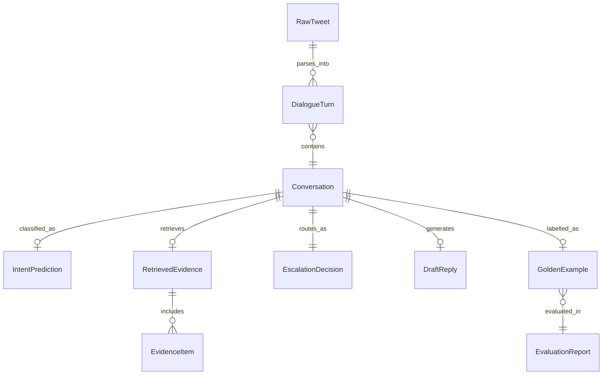

# Data Model Specification: Hiver Support Agent

**Feature Branch**: `001-support-agent`  
**Date**: 2026-09-12  
**Status**: Complete  

This document defines the core data entities, schemas, validation rules, and lifecycle transitions for the Hiver Support Agent pipeline.

---

## 1. Entity Relationship Diagram



---

## 2. Core Entity Definitions

### 2.1 RawTweetRecord
Represents a single verbatim row from `data/raw/twcs.csv`.

```python
class RawTweetRecord(BaseModel):
    tweet_id: int
    author_id: str
    inbound: bool
    created_at: datetime
    text: str
    response_tweet_id: Optional[str] = None  # May contain comma-separated IDs
    in_response_to_tweet_id: Optional[int] = None

    class Config:
        frozen = True
```

**Validation Rules**:
- `tweet_id` must be positive.
- `text` must not be null/empty.
- `inbound` must be boolean.

---

### 2.2 DialogueTurn
A single normalized message within a reconstructed conversation.

```python
class SpeakerRole(str, Enum):
    CUSTOMER = "customer"
    AGENT = "agent"

class DialogueTurn(BaseModel):
    tweet_id: int
    speaker: SpeakerRole
    author_id: str
    text: str  # HTML entities unescaped, normalized whitespace
    created_at: datetime

    class Config:
        frozen = True
```

**Validation Rules**:
- `speaker` must be either `customer` or `agent`.
- `text` must have HTML entities (`&amp;`, `&gt;`, `&lt;`) decoded.

---

### 2.3 Conversation
A full reconstructed customer-support dialogue thread rooted at an inbound customer inquiry.

```python
class Conversation(BaseModel):
    conversation_id: int  # Equals root tweet_id
    brand: str = "AppleSupport"
    created_at: datetime  # Root tweet timestamp
    turns: List[DialogueTurn]
    root_text: str  # Text of the first customer turn
    turn_count: int
    customer_id: str
    is_multi_turn: bool
    has_broken_link: bool = False

    @property
    def resolution_turn(self) -> Optional[DialogueTurn]:
        """Returns the final agent response turn if present."""
        agent_turns = [t for t in self.turns if t.speaker == SpeakerRole.AGENT]
        return agent_turns[-1] if agent_turns else None
```

**Validation Rules**:
- `turns` must contain at least 1 customer turn and 1 agent turn for resolved historical conversations.
- `turn_count` equals `len(turns)`.
- `turns` must be strictly ordered chronologically by `created_at`.

---

### 2.4 Intent Taxonomy & Prediction

```python
class IntentCode(str, Enum):
    INT_IOS = "INT-IOS"
    INT_STORE = "INT-STORE"
    INT_ICLOUD = "INT-ICLOUD"
    INT_HARDWARE = "INT-HARDWARE"
    INT_CONN = "INT-CONN"
    INT_BATTERY = "INT-BATTERY"
    INT_WATCH_MAC = "INT-WATCH-MAC"
    INT_OUT_OF_SCOPE = "INT-OUT-OF-SCOPE"

class IntentPrediction(BaseModel):
    conversation_id: int
    label: IntentCode
    confidence: float  # Calibrated probability in [0.0, 1.0]
    supporting_excerpt: str
    model_version: str
    created_at: datetime
```

**Validation Rules**:
- `confidence` must satisfy $0.0 \le \text{confidence} \le 1.0$.
- `label` must be a valid member of `IntentCode`.

---

### 2.5 Retrieval & Evidence

```python
class EvidenceItem(BaseModel):
    source_conversation_id: int
    relevance_score: float  # Normalized BM25 score in [0.0, 1.0]
    intent_label: IntentCode
    customer_query: str
    agent_resolution: str
    is_dm_escalation: bool
    temporal_date: datetime

class RetrievedEvidence(BaseModel):
    query_conversation_id: int
    items: List[EvidenceItem]
    top_score: float
    retrieval_latency_ms: float
    is_empty: bool
```

**Validation Rules**:
- `items` length must not exceed $k_{max} = 10$.
- `top_score` must equal `max([item.relevance_score for item in items])` if items exist, else `0.0`.

---

### 2.6 Escalation & Routing Decision

```python
class RoutingDecision(str, Enum):
    AUTO_HANDLE = "auto-handle"
    ESCALATE = "escalate"

class EscalationDecision(BaseModel):
    conversation_id: int
    routing: RoutingDecision
    triggers: List[str]  # List of triggered escalation reasons
    intent_confidence: float
    evidence_top_score: float
    rationale: str
    decision_timestamp: datetime
```

**Validation Rules**:
- If `triggers` is non-empty, `routing` MUST be `ESCALATE`.
- If `intent_confidence < threshold` or `is_empty == True`, `routing` MUST be `ESCALATE`.

---

### 2.7 Draft Reply Generation

```python
class DraftReply(BaseModel):
    conversation_id: int
    draft_text: str
    cited_evidence_ids: List[int]
    intent_label: IntentCode
    escalation_routing: RoutingDecision
    escalation_rationale: str
    generation_latency_ms: float
    generated_at: datetime
```

---

### 2.8 Rule-Assisted Curated Development Benchmark (`GoldenExample`)

```python
class GoldenExample(BaseModel):
    golden_id: str  # e.g., "GOLDEN-001"
    conversation_id: int
    root_text: str
    true_intent: IntentCode
    true_escalation: RoutingDecision  # "auto-handle" or "escalate"
    reference_reply: Optional[str] = None
    annotator_id: str = "rule_assisted_curated"
    label_notes: Optional[str] = None
```

**Validation & Provenance Rules**:
- `conversation_id` must NOT exist in the retrieval corpus manifest (zero leakage).
- `annotator_id` must be `rule_assisted_curated` reflecting that intent and escalation labels were assigned using deterministic, rule-assisted curation over authentic source dataset conversations (used for component iteration and developer regression testing).

---

### 2.9 Independently Human-Validated Test Benchmark (`HumanAnnotationRecord`)

```python
class HumanAnnotationRecord(BaseModel):
    conversation_id: int
    customer_text: str
    created_at: Optional[str] = None
    turns: List[Dict[str, Any]] = Field(default_factory=list)
    intent: Optional[IntentCode] = None
    escalation_required: Optional[bool] = None
    ambiguity: Optional[bool] = None
    annotator_id: Optional[str] = None
    annotation_version: Optional[str] = None
    annotation_notes: Optional[str] = None
```

**Validation & Integrity Rules**:
- **Unpopulated Candidate Fixture**: In `human_benchmark_unannotated.jsonl`, all ground truth fields (`intent`, `escalation_required`, `ambiguity`, `annotator_id`, `annotation_version`) MUST be `null`.
- **Completed Test Set**: In `human_benchmark.jsonl`, all ground-truth fields must be populated by human reviewers.
- **Automated Annotator Prohibition**: `annotator_id` is strictly validated to reject automated/heuristic strings (`rule_assisted`, `automated`, `bot`, `gemini`, `gpt`, `llm`, `mock`).
- **3-Way Disjointness**: `conversation_id` must have ZERO overlap with `retrieval_corpus.jsonl` AND `golden_set.jsonl`.

---

### 2.10 Human Benchmark Cryptographic Freeze Manifest (`HumanBenchmarkManifest`)

```python
class HumanBenchmarkManifest(BaseModel):
    frozen_at: str
    benchmark_sha256: str
    record_count: int
    conversation_ids_sha256: str
    source_twcs_sha256: str
    temporal_split_date: str = "2017-11-01"
    annotation_version: str
    annotator_ids: List[str]
```

---

### 2.11 Evaluation Run Manifest & Report

```python
class MetricResult(BaseModel):
    metric_name: str
    score: float
    baseline_score: float
    sample_count: int
    passed_target: bool

class FailureCaseRecord(BaseModel):
    example_id: str
    failure_category: str
    conversation_id: int
    input_text: str
    expected_output: Dict[str, Any]
    actual_output: Dict[str, Any]
    decision_trace: Dict[str, Any]

class EvaluationReport(BaseModel):
    run_id: str
    run_timestamp: datetime
    execution_duration_sec: float
    golden_set_size: int
    leakage_check_passed: bool
    headline_metrics: Dict[str, MetricResult]
    per_class_f1: Dict[IntentCode, float]
    confusion_matrix: Dict[str, Dict[str, int]]
    failure_mode_analysis: List[FailureCaseRecord]
    llm_judge_agreement_rate: float
```

